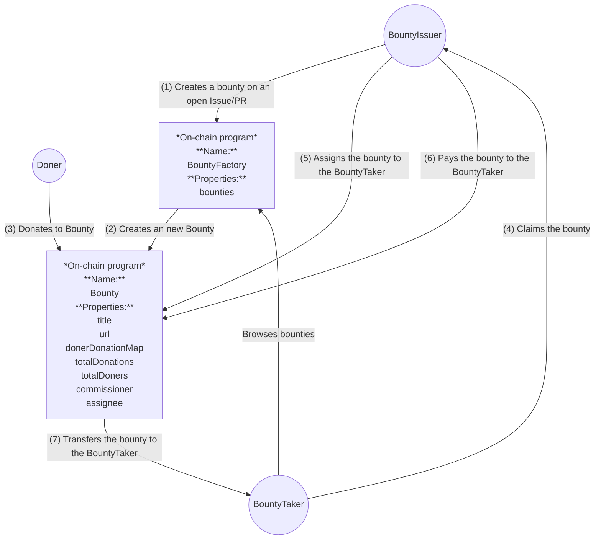

# Contract Design

This document describes the contract design for the bounty system.

## Misc

- https://docs.github.com/en/issues/tracking-your-work-with-issues/using-issues/assigning-issues-and-pull-requests-to-other-github-users
