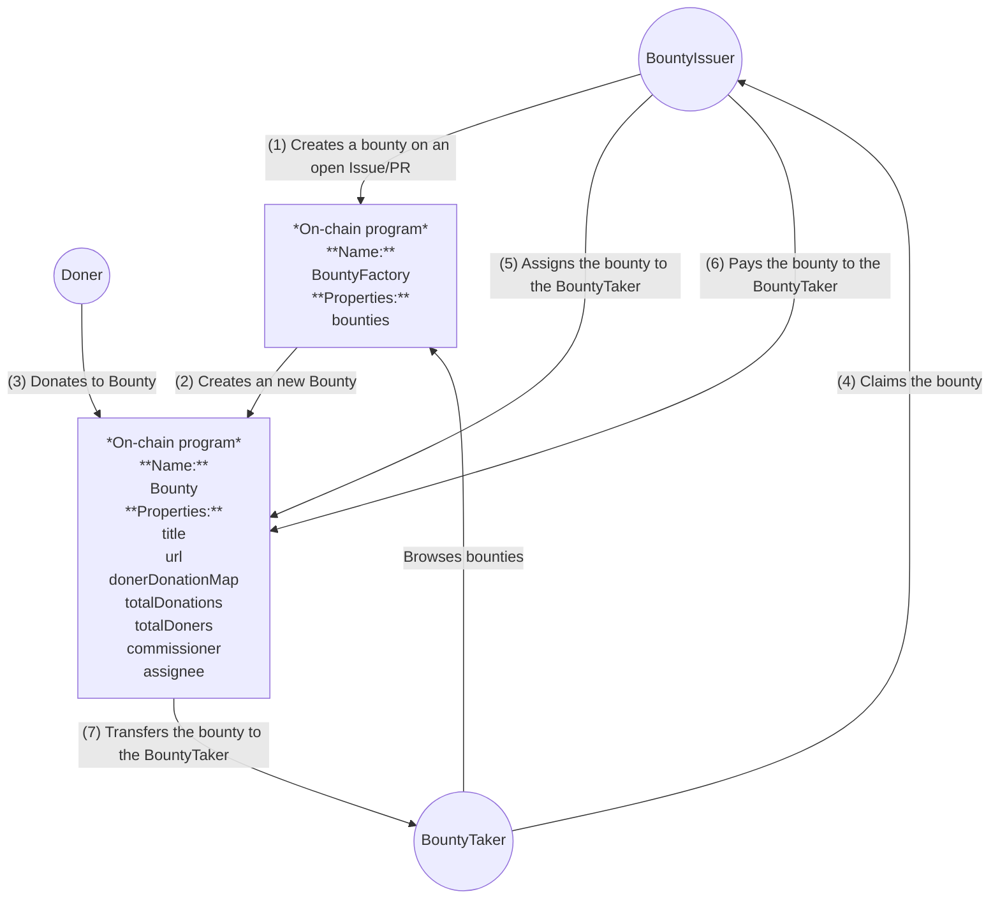

# Contract - Flow Chart

This flow chart describes the contract design for the system.

```mermaid
flowchart
    BountyIssuer((
        BountyIssuer
    ))

    BountyTaker((
        BountyTaker
    ))

    Doner((
        Doner
    ))

    Bounty[
        *On-chain program*
        **Name:**
        Bounty
        **Properties:**
        title
        url
        donerDonationMap
        totalDonations
        totalDoners
        commissioner
        assignee
    ]

    BountyFactory[
        *On-chain program*
        **Name:**
        BountyFactory
        **Properties:**
        bounties
    ]

    BountyIssuer -- (1) Creates a bounty on an open Issue/PR --> BountyFactory

    BountyFactory -- (2) Creates an new Bounty --> Bounty

    Doner -- (3) Donates to Bounty --> Bounty

    BountyTaker -- Browses bounties --> BountyFactory

    BountyTaker -- (4) Claims the bounty --> BountyIssuer

    BountyIssuer -- (5) Assigns the bounty to the BountyTaker --> Bounty

    BountyIssuer -- (6) Pays the bounty to the BountyTaker --> Bounty

    Bounty -- (7) Transfers the bounty to the BountyTaker --> BountyTaker
```
